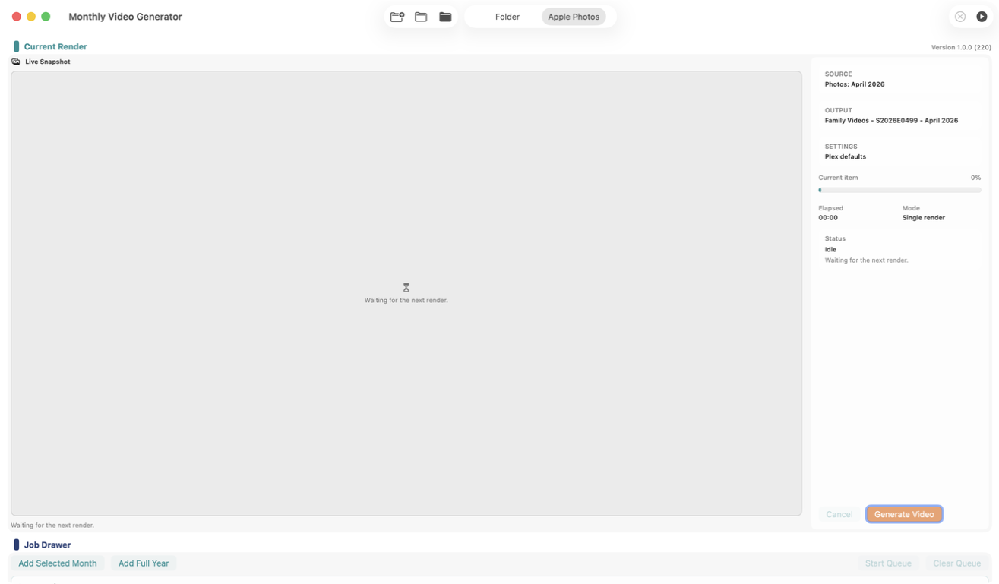
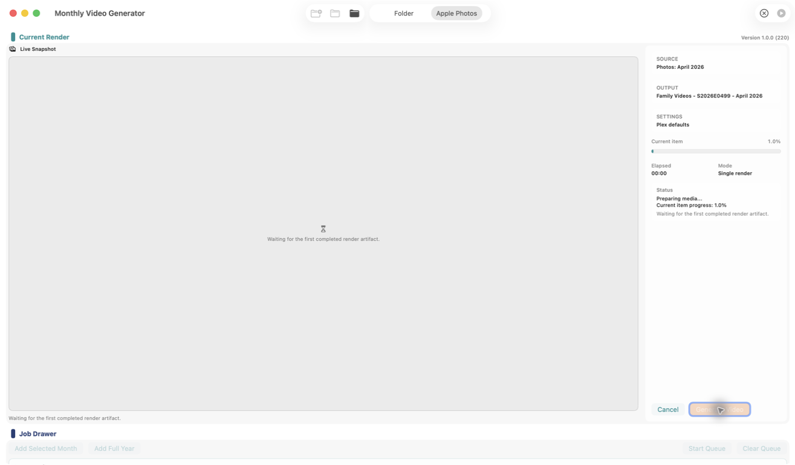

# Monthly Video Generator

Monthly Video Generator is a local-only macOS app for turning family photos and videos into monthly slideshow movies.

It works with either regular folders or Apple Photos, and it is built around an Apple-centric workflow: macOS, Apple Photos, Plex/Infuse metadata, and HDR-capable playback.



Idle overview of the current `1.0.0` app layout, with the Light Table, Job Drawer, and export controls in view.



Live export state showing the same workflow during a real render.

## Project Status

Feature complete personal project.

The app is now at `1.0.0` and I consider it feature complete for its intended job. I will probably keep making tweaks, quality-of-life improvements, and small fixes over time, but I am not treating it as an open-ended platform rewrite.

Packaged releases are the intended way to use it.

## What It Does

- Builds monthly videos from mixed photos and videos.
- Works from either folders or Apple Photos.
- Supports album-based Apple Photos exports, including mixed-month albums.
- Adds title cards, crossfades, captions, and capture-date overlays.
- Queues multiple exports and can pause after the current job.
- Produces Plex-friendly MP4 metadata and chapter markers for the current workflow.
- Ships with the HDR export path I actually use, including bundled FFmpeg/ffprobe in packaged builds.

## Current Shape

The app is built around a large current-render view plus a compact job drawer underneath it.

What is stable right now:

- Folder-based rendering.
- Apple Photos month/year rendering.
- Apple Photos album rendering.
- Queue-based export workflow.
- Settings for style and export defaults.
- HDR HEVC exports for the current Plex/Infuse/Apple TV 4K setup.
- Local-only operation with no telemetry or cloud service dependency.

Known rough edges:

- Large HDR exports can be slow and resource-heavy.
- Apple Photos exports can spend a while materializing media before visible progress shows up.
- Packaged builds are ad-hoc signed, not notarized.
- Some of the long-running HDR recovery/resume behavior is functional but still a bit technical in feel.

## Distribution Notes

Packaged builds are currently ad-hoc signed for local distribution and are **not notarized**.

That helps, but it does not remove macOS trust prompts for downloaded copies.

If macOS blocks launch:

1. Try opening the app once from Finder.
2. If needed, Control-click the app and choose `Open`.
3. Or go to `System Settings -> Privacy & Security` and choose `Open Anyway`.

If full Developer ID signing and notarization are added later, the docs and release workflow will say so explicitly.

## Build From Source

Minimum working assumption: macOS 15 with Swift installed.

Build the package:

```bash
swift build
```

Run tests:

```bash
swift test
```

Run the app from source:

```bash
swift run MonthlyVideoGeneratorApp
```

Build a packaged `.app` bundle:

```bash
./scripts/build_app.sh
```

Create a `.dmg` from that app bundle:

```bash
./scripts/create_dmg.sh
```

The packaged app build uses the checked-in `VERSION` and `BUILD_NUMBER` files as the source of truth for the app version/build, and the packaging scripts do not silently mutate them.

## Release Versioning

When I want a new publishable release identity, I use:

```bash
./scripts/prepare_release.sh
```

That bumps the checked-in patch version and build number together. Actual publication still depends on committing and pushing those changes.

This repo also uses committed bundled FFmpeg/ffprobe slices for packaged builds. If you are digging into that part of the app, see [docs/THIRD_PARTY.md](docs/THIRD_PARTY.md).

## AI Assistance

Like most of my recent projects, this repo was built with heavy AI assistance using tools like Codex and Claude.

The workflow, decisions, and verification are still grounded in the real app and real exports, not just generated code.

## More Context

- Current project status: [docs/WHERE_WE_STAND.md](docs/WHERE_WE_STAND.md)
- HDR/colorspace reference: [docs/HDR_COLOR_REFERENCE.md](docs/HDR_COLOR_REFERENCE.md)
- Third-party tooling notes: [docs/THIRD_PARTY.md](docs/THIRD_PARTY.md)
- License: [LICENSE](LICENSE)
